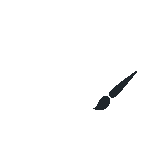

# 🎨 Editor Tldraw

Editor de dibujo interactivo construido con Next.js, Tldraw y tRPC para prueba técnica.



## ✨ Características

- **Editor de dibujo completo** basado en la biblioteca [Tldraw](https://tldraw.com/)
- **Guardado automático** de cambios mediante tRPC
- **Interfaz intuitiva** con TailwindCSS y Shadcn UI
- **Manejo de frames** con selección de contenido
- **Comunicación tipo-segura** entre cliente y servidor con tRPC

## 🛠️ Tecnologías

- **Frontend**: [Next.js](https://nextjs.org/) con App Router
- **Editor**: [Tldraw](https://tldraw.com/)
- **Estilos**: [TailwindCSS](https://tailwindcss.com/) y [Shadcn UI](https://ui.shadcn.com/)
- **API**: [tRPC](https://trpc.io/) para comunicación tipo-segura
- **Tipado**: TypeScript

## 🚀 Instalación

1. Clona el repositorio:
   ```bash
   git clone https://github.com/tu-usuario/editor-next.git
   cd editor-next
   ```

2. Instala las dependencias:
   ```bash
   npm install
   ```

3. Inicia el servidor de desarrollo:
   ```bash
   npm run dev
   ```

4. Abre [http://localhost:3000](http://localhost:3000) en tu navegador.

## 📖 Uso

### Página principal
La página principal muestra un botón para acceder al editor.

### Editor
El editor proporciona una interfaz completa de dibujo con las siguientes funcionalidades:

- **Herramientas de dibujo**: Formas, líneas, texto, etc.
- **Frames**: Contenedores para organizar elementos
- **Estilos**: Colores, tamaños, rellenos, etc.

### Trabajando con Frames

1. **Selecciona un frame** haciendo clic en él
2. Aparecerá un panel en la esquina superior derecha
3. Haz clic en **"Seleccionar contenido"** para seleccionar todos los elementos dentro del frame
4. Usa la **paleta de estilos nativa** de Tldraw para modificar los elementos seleccionados

## 🔄 API y Persistencia

El proyecto utiliza tRPC para crear una API tipo-segura que permite:

- **Obtener documentos** guardados previamente
- **Guardar cambios** automáticamente cuando se modifican elementos

## 🧩 Estructura del Proyecto

```
src/
├── app/                         # App Router de Next.js
│   ├── page.tsx                 # Página principal
│   ├── editor/                  # Página del editor
│   │   └── page.tsx
│   └── api/                     # Endpoints de API
│       └── trpc/                # Configuración de tRPC
├── components/                  # Componentes reutilizables
│   └── ui/                      # Componentes de UI (Shadcn)
├── server/                      # Lógica del servidor
│   ├── config.ts                # Configuración de tRPC
│   └── routers/                 # Routers de tRPC
│       ├── _app.ts              # Router principal
│       └── editor.ts            # Endpoints del editor
└── lib/                         # Utilidades
    └── trpc.ts                  # Cliente tRPC
```

## 🤝 Contribuir

Las contribuciones son bienvenidas. Por favor, sigue estos pasos:

1. Haz fork del repositorio
2. Crea una rama para tu característica (`git checkout -b feature/amazing-feature`)
3. Haz commit de tus cambios (`git commit -m 'Add some amazing feature'`)
4. Haz push a la rama (`git push origin feature/amazing-feature`)
5. Abre un Pull Request


<!-- 
# 🎨 Editor Tldraw

Editor de dibujo interactivo desarrollado con Next.js, Tldraw y tRPC para demostraciones técnicas.  
Ofrece herramientas de dibujo avanzadas, guardado automático y una interfaz intuitiva para la edición de contenidos gráficos.


## ✨ Características

- **Editor de dibujo completo** basado en la biblioteca [Tldraw](https://tldraw.com/)
- **Guardado automático** de cambios mediante tRPC
- **Interfaz intuitiva** con TailwindCSS y Shadcn UI
- **Manejo de frames** con selección de contenido
- **Comunicación tipo-segura** entre cliente y servidor gracias a tRPC

## 🛠️ Tecnologías

- **Frontend**: [Next.js](https://nextjs.org/) con App Router
- **Editor**: [Tldraw](https://tldraw.com/)
- **Estilos**: [TailwindCSS](https://tailwindcss.com/) y [Shadcn UI](https://ui.shadcn.com/)
- **API**: [tRPC](https://trpc.io/) para comunicación tipo-segura
- **Tipado**: TypeScript

## 🚀 Instalación

1. Clona el repositorio:
   ```bash
   git clone https://github.com/tu-usuario/editor-next.git
   cd editor-next -->
