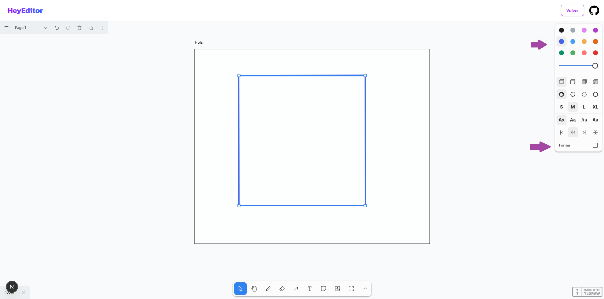

# 🎨 Editor Tldraw

Editor de dibujo interactivo construido con Next.js, Tldraw y tRPC para prueba técnica.


## ✨ Características

- **Editor de dibujo completo** basado en la biblioteca [Tldraw](https://tldraw.com/)
- **Guardado automático** de cambios mediante tRPC
- **Interfaz intuitiva** con TailwindCSS y Shadcn UI
- **Manejo de frames** con selección de contenido
- **Comunicación tipo-segura** entre cliente y servidor con tRPC

## 🛠️ Tecnologías

- **Frontend**: [Next.js](https://nextjs.org/) con App Router
- **Editor**: [Tldraw](https://tldraw.com/)
- **Estilos**: [TailwindCSS](https://tailwindcss.com/) y [Shadcn UI](https://ui.shadcn.com/)
- **API**: [tRPC](https://trpc.io/) para comunicación tipo-segura
- **Tipado**: TypeScript

## 🚀 Instalación

1. Clona el repositorio:
   ```bash
   git clone https://github.com/tu-usuario/editor-next.git
   cd editor-next
   ```

2. Instala las dependencias:
   ```bash
   npm install
   ```

3. Inicia el servidor de desarrollo:
   ```bash
   npm run dev
   ```

4. Abre [http://localhost:3000](http://localhost:3000) (o el puerto que indique tu consola) en tu navegador.

## 📖 Uso

### Página principal

La primera página te da la bienvenida y puedes acceder al editor mediante el botón del header o el que aparece debajo de la bienvenida.

### Editor y creación de figuras

A continuación, te muestro el flujo básico para usar el editor.

1. **Crear una figura**
   En la primera imagen, simplemente dibujamos o insertamos una nueva figura en el lienzo.
   

2. **Seleccionar un frame**
   Una vez tengamos figuras en el lienzo, en la segunda imagen vemos cómo se selecciona un frame para agrupar o contener ciertos elementos.
   

3. **Seleccionar figuras dentro del frame**
   En la tercera imagen, seleccionamos una o varias figuras que queremos modificar dentro de ese frame.
   

4. **Ver panel lateral y botón de contenido**
   En la cuarta imagen, aparece un panel en la derecha que indica qué frame está seleccionado y muestra un botón para "Seleccionar contenido".
   

5. **Cambiar color y forma de la figura**
   Finalmente, con la figura dentro del frame seleccionada, se abre la paleta de colores (y de formas) para modificar la apariencia de los elementos dentro del frame. Aquí se ve la UI nativa de Tldraw para cambiar tanto el color como la forma de la figura seleccionada.
   

## 🔄 API y Persistencia

El proyecto utiliza tRPC para crear una API tipo-segura que permite:

- **Obtener documentos** guardados previamente.
- **Guardar cambios** automáticamente cuando se modifican elementos en el lienzo.

## 🛠️ Notas Técnicas

- **Tipado de Tldraw**: Los tipos de Tldraw pueden ser complejos y causar errores de recursión infinita en TypeScript. Se definieron tipos personalizados en `src/types/tldraw.ts` (`EditorInstance` y `ShapeData`) para simplificarlos y mantener la seguridad de tipos donde es crítico (e.g., tRPC).
- **Configuración de ESLint**: Las reglas `@typescript-eslint/no-explicit-any` y `@typescript-eslint/no-unused-vars` se relajaron a "warn" en `src/app/editor/page.tsx` (ver `eslint.config.mjs`) debido a limitaciones con los tipos de Tldraw. Esto se hizo para priorizar la funcionalidad sin sacrificar la rigurosidad en el resto del proyecto.

## 🔍 Cómo Probar

### Probar el Botón de Modificar Forma
1. Dibuja una forma en el editor.
2. Añádelo a un frame.
3. Haz clic en "seleccionar contenido".
4. Selecciona el contenido dentro del frame que quieras modificar.
5. Haz clic en "Modificar Forma" en la parte inferior de la ventana de la derecha.
6. Verifica que la primera figura cambia de forma.

### Probar Modificar Color
1. Dibuja una forma en el editor o introduce algún texto.
2. Añádelo a un frame.
3. Haz clic en "seleccionar contenido".
4. Selecciona el contenido dentro del frame que quieras modificar.
5. Haz clic en el color al que deseas cambiar el contenido en la ventana de la derecha.
6. Verifica que el contenido seleccionado cambia de color.

### Probar el Guardado Automático
1. Crea o modifica una forma en el lienzo.
2. Abre la consola del navegador para ver las peticiones tRPC (`saveDocument`) enviando los datos actualizados.